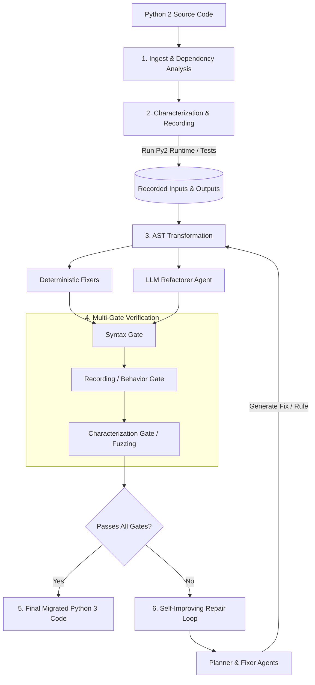

# ShiftCode

Autonomous Legacy Code-Based Migration and Refactoring Engine.

ShiftCode takes a legacy codebase and migrates it to a modern equivalent
using a multi-agent LLM pipeline layered on top of deterministic tooling —
with the correctness of the migration treated as the actual product, not an
afterthought. It never marks a file "done" without passing a verification
gate, and it is explicit about *how confident* it is in that verification.

For the deep technical reference (agents, verification internals, sandbox
security model, the self-improving fixer library, architecture) see
[Further reading](#further-reading) below — this file is the front door.

## Goal

Long-term: take an arbitrary legacy codebase (any source language/version)
and autonomously migrate it to a current equivalent, with behavior provably
preserved wherever it's possible to prove that, and an honest "needs human
review" flag wherever it isn't.

The hard requirement driving every design decision here: **never claim a
migration succeeded without actually verifying it.** A wrong migration that
looks confident is worse than no migration at all — so the pipeline is built
around real execution and real comparison, not an LLM's opinion of whether
code "looks right."

## Who this is for

Anyone sitting on a real Python 2 codebase who needs it migrated with proof
attached, not just code that happens to parse under Python 3. Especially
valuable where a *wrong* migration is worse than *no* migration — real test
suites get run against both interpreters and compared, not just eyeballed;
files with no test suite at all still get real auto-generated verification
instead of a shrug. Real py2/py3 behavior traps this project specifically
watches for (a growing, evidence-driven list, not exhaustive — see
`docs/bug-log.md`): ambiguous division, `cmp()`/`__cmp__` removal, silent
bytes/str drift from `.encode(...)`, removed stdlib modules and legacy
`types` imports, and more added every time a real one is found.

Not (yet) a fit for: anything other than Python 2 → Python 3, coordinated
cross-file refactors in one shot (each file gets its own plan and repair
loop), or batch/multi-repo orchestration.

## Current capabilities

MVP scope, working end to end against a real LLM (tested with Gemini via its
OpenAI-compatible endpoint) and a real Python 2 runtime (Docker):

- **Multi-file aware verification** — a file's real sibling/package imports
  resolve for real inside the sandbox, validated against genuinely popular
  real libraries, not just synthetic fixtures. Details: `docs/architecture.md`.
- **Differential fuzzing for Mode C** — optionally expands auto-generated
  test evidence from a handful of examples to hundreds of deterministically-generated
  cases per function, zero extra LLM cost. Details: `docs/verification.md`.
- **Self-improving fixer library** — confirmed repairs can be captured and
  turned into permanent, deterministic detectors, automating the first draft
  of exactly the kind of fixer this project already adds by hand when it
  finds a new bug class. Details: `docs/self-improving-fixer-library.md`.
- **Class-method characterization for Mode C** — auto-generated tests now
  cover class methods too, not just top-level functions: constructs a real
  instance, then calls the method on it, same zero-trust literal-only input
  safety as everywhere else. Unblocks class-only files that previously had
  nothing for Mode C to characterize at all.
- **Record/replay verification against real usage data (Mode R)** — a
  solo-developer-feasible version of shadow testing: record real
  `(args → result)` calls from your own Python 2 code in your own
  environment, replay those exact real inputs against the migrated
  candidate later, entirely offline, no live py2 interpreter needed at
  verify time. Details: `docs/verification.md`.
- **Checkpoint/resume** — `--checkpoint-dir` writes a per-file snapshot as
  each file reaches a real terminal outcome; a later run pointed at the same
  directory skips re-processing any file whose source hasn't changed,
  zero further LLM/sandbox cost for it. A killed run no longer means
  starting over from scratch.
- **Provider-agnostic** — any OpenAI-compatible endpoint, config not code.
  See *Works with any LLM provider* below.
- 313 unit tests, all passing, none of which require a real LLM or Docker.

## How it works

ShiftCode operates through an automated, multi-stage pipeline designed to migrate Python 2 codebases to Python 3 with verified functional equivalence.

1. Ingestion & Dependency Graph Analysis: ShiftCode ingests the target Python 2 project, parses external dependencies, and maps module call sites.
2. Characterization & Behavior Recording: Runs the original code under a Python 2 sandbox runtime to record execution behavior, capture deterministic outputs, and generate dynamic characterization tests/fuzzing payloads.
3. AST & Agent Transformation: Applies standard deterministic transformations via custom AST fixers alongside LLM-powered refactorer agents for complex code patterns.
4. Multi-Gate Verification:
    - Syntax Gate: Ensures the modified code is valid Python 3.
    - Behavior Gate: Replays captured execution recordings against the transformed code inside isolated Python 3 sandbox containers.
    - Characterization Gate: Executes tests and generated fuzz payloads to ensure zero regression in edge cases.

5. Self-Improving Repair Loop: If any verification gate fails, failure logs and execution context are dispatched to the Planner and Fixer Agents to refine AST rules or refactoring strategies, looping back until verification succeeds.

## Outcome categories

Every file lands on exactly one status, ranked strongest to weakest, and the
report is explicit about which:

| Status | Evidence | Confidence |
|---|---|---|
| `VERIFIED` | A real, human-authored test suite (or `__main__` golden output) run against both the original and migrated code, and it agreed | Strongest — a human wrote and trusted this test |
| `VERIFIED_RECORDED` | Real `(args → result)` pairs recorded from the original Python 2 code actually running (Mode R), replayed against the candidate | Stronger than a guessed input, but no human ever asserted the recorded output was itself correct |
| `VERIFIED_INFERRED` | No human-authored test suite existed — ShiftCode auto-generated characterization tests and ran them against both interpreters | Real signal (expected behavior always comes from executing the original code, never an LLM's guess), but weaker — kept distinct so the report never overclaims |
| `NEEDS_REVIEW` | A gate failed, or nothing could verify the file at all (no test suite, no entry point, no characterization evidence) | Always comes with a real reason attached — a failed comparison, an exhausted repair budget with full attempt history, or an honest "couldn't verify this way" — never silently skipped |

**Confidence is never blended** into one number across these tiers — that's
deliberate. What *does* get reported within a tier is real evidence volume:
`cases_run`/`cases_passed` (e.g. `206/209 cases passed (Mode A)`) — the
exact count of tests or characterization cases actually executed, not a
synthesized score. Two files can both be `VERIFIED_INFERRED`, but one backed
by 3 examples and another by 300 fuzzed cases is meaningfully different
evidence, and the report makes that visible instead of hiding it. Full
semantics per mode: `docs/verification.md`.

## Works with any LLM provider

Not tied to Claude, or to any single vendor. The only requirement is an
OpenAI-compatible chat-completions endpoint — covers OpenAI itself, Google
Gemini, Ollama, LM Studio, vLLM's OpenAI server, and most hosted providers.
Switching providers is a config change, not a code change:

```bash
# .env (gitignored, see .env.example)
SHIFTCODE_LLM_API_KEY=sk-...
SHIFTCODE_LLM_MODEL=gpt-4o
SHIFTCODE_LLM_BASE_URL=https://api.openai.com/v1        # or omit for the default

# or, for a fully local setup, no API key needed:
SHIFTCODE_LLM_BASE_URL=http://localhost:11434/v1          # Ollama
SHIFTCODE_LLM_MODEL=llama3
```

Each agent can also be routed to a different model/provider independently —
see `docs/agents.md`.

## Setup

```bash
python3 -m venv .venv && source .venv/bin/activate
pip install -e ".[dev]"
cp .env.example .env   # fill in SHIFTCODE_LLM_API_KEY / MODEL / BASE_URL
```

A Python 2 runtime is required for real (non-`UNVERIFIED`) behavior
verification — either a `python2`/`python2.7` binary on `PATH`, or Docker
with the `python:2.7` image pulled. Without one, every behavior gate
correctly degrades to `UNVERIFIED` rather than fabricating a pass.

```bash
pytest                                          # 313 tests, no LLM/Docker required
shiftcode migrate <path> --checkpoint-dir .shiftcode/checkpoint  # resume-safe: skips already-finished files on a re-run
shiftcode migrate <path> --dry-run              # list findings only, no LLM calls
shiftcode migrate <path> --output-dir ./out     # full run
shiftcode migrate <path> --characterization-fuzz-cases 50 --capture-repair-history  # opt into fuzzing + repair capture
shiftcode suggest-fixer-rules --history .shiftcode/repair_history.jsonl --out candidate_fixers/  # offline, draft candidate detectors
shiftcode init-recorder --out shiftcode_record.py               # copy the standalone py2-compatible recorder
shiftcode migrate <path> --recordings-dir .shiftcode/recordings # verify against real recorded usage (Mode R)
```

## Validated against real code

17 real, unattended runs against real-world libraries pulled from GitHub at
their actual pre-migration commit (not the bundled fixtures) — `docopt`,
`python-slugify`, `inflection`, `jsonschema`, `purl`, `html2text`,
`schedule`, `requests`, `toolz` (twice — once for the migration pipeline
itself, once specifically to stress-test Mode R/record-replay against a
real third-party function), `blinker`, `argcomplete` (each re-validated
multiple times as fixes landed, including finally root-causing a mismatch
left undiagnosed across 3 earlier rounds), plus a full corpus regression
re-run and a dedicated model-capability-limit investigation. 36 real bugs
found and fixed as a direct result, each with root cause and fix documented.
Full run-by-run record, including crashed/blocked runs (this is an honest
log, not a highlight reel):
`docs/stress-test-log.md`. The bugs themselves, with root cause and what now
catches that class going forward: `docs/bug-log.md`. The standing
find/run/diagnose/design/confirm process every run follows:
`docs/stress-test-methodology.md`.

## Known limitations

Three different kinds of limitation, deliberately kept distinct — a
permanent scope choice, a confirmed hard ceiling, and an open design
question all warrant a different level of concern.

**Scope, by design — not planned to change without a separate decision:**

- Python 2 → Python 3 only; no other language pair implemented.
- Migration itself is still one file at a time — each file gets its own
  plan and its own repair loop, no coordinated cross-file edit.
  Verification, however, is multi-file-aware (real dependency closures,
  see `docs/architecture.md`).
- No multi-repo/batch orchestration yet.
- `--checkpoint-dir` resumability only skips a file that fully finished
  (reached VERIFIED/VERIFIED_INFERRED/VERIFIED_RECORDED/NEEDS_REVIEW) in a
  previous run — a file killed partway through its own Phase A or Phase B
  has no checkpoint entry yet and gets fully redone, not resumed mid-file.
  Still a real improvement over "restart everything," not a claim of
  finer-grained recovery than that.

**Confirmed model-capability ceiling, not budget-limited:**

- Some real repair failures are reproducibly beyond the configured model's
  capability — raising `max_repair_attempts` from 3 to 8 changed nothing on
  3 independent real cases (identical failure every attempt in one case;
  the Auditor cycling through contradictory theories without ever
  converging in the other two). See `docs/stress-test-log.md` entry 16 for
  the full investigation, including why a mechanical fallback for the
  simpler of the two failure shapes turned out not to be safely buildable
  either.

**Open design question, not yet resolved either way:**

- Mode B's stderr comparison filters known Python interpreter warning noise
  (`docs/bug-log.md` #34) but still requires exact equality on everything
  else — a program's own real stderr output gets no special tolerance
  beyond that. Fine for the case that's actually been hit so far; how
  strict this *should* be for anything broader is still an open question.

Implementation-level limitations (heuristic import-matching specifics,
symbol-splice fallback behavior, etc.) are in `docs/architecture.md`.

## Further reading

- [`docs/architecture.md`](docs/architecture.md) — pipeline stages in depth,
  dependency-closure design, why the Refactorer splices by symbol, full file
  map.
- [`docs/agents.md`](docs/agents.md) — all six agents: what each does, where
  it lives, and why it's built the way it is; multi-provider routing.
- [`docs/verification.md`](docs/verification.md) — Mode A/R/B/C mechanics
  (including record/replay), differential fuzzing internals, the sandbox
  security model, evidence-count semantics.
- [`docs/self-improving-fixer-library.md`](docs/self-improving-fixer-library.md) —
  the capture → draft → graduate mechanism in full, and the real feasibility
  test behind why the draft step is never auto-applied.
- [`docs/bug-log.md`](docs/bug-log.md) — every real bug found in ShiftCode
  itself, root cause, and the fix.
- [`docs/stress-test-log.md`](docs/stress-test-log.md) — every real library
  ShiftCode has been run against, outcome, status.
- [`docs/stress-test-methodology.md`](docs/stress-test-methodology.md) — the
  standing process every stress-test run follows.
