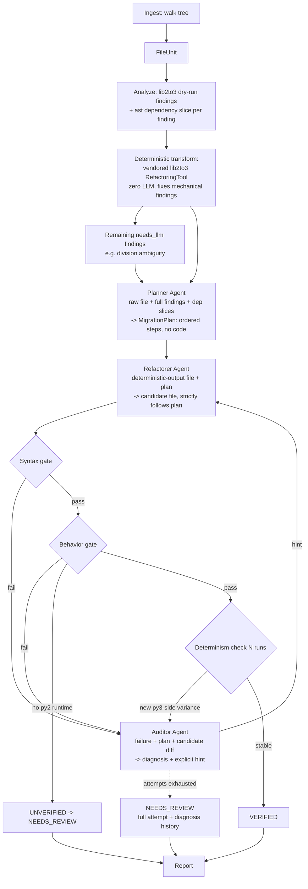

# ShiftCode — MVP Architecture: Py2→Py3 Migration Pipeline (multi-agent)

## Context

ShiftCode ("Autonomous Legacy Code-Based Migration and Refactoring Engine") is currently an empty repo (`README.md` only, one commit). This is the architecture step.

The first pass at this plan used a single "do everything" LLM call (understand + refactor + repair, one big prompt, retried on failure). The user rejected that shape explicitly: they want a **true multi-agent workflow** with separated responsibilities —

- **Planner**: reads the file + findings, does not write code, outputs a structured step-by-step migration plan.
- **Refactorer**: takes the file + the plan, writes the actual code patch, strictly following the plan.
- **Auditor/Reviewer**: only runs when a verification gate fails; reads the failure (traceback/SyntaxError/diff) and writes back an explicit, targeted hint for the Refactorer to retry with — like a senior reviewer diagnosing _why_ it broke, not just "try again."

Everything else from the prior round stands: not Claude-locked (OpenAI-compatible client), Py2→Py3-only MVP scope, correctness-as-product with deterministic multi-run verification, `lib2to3` vendored for the mechanical fixes, LLM only for judgment calls the deterministic fixer can't make. I re-verified the environment findings directly in this sandbox:

- `lib2to3` is present at `/usr/lib/python3.11/lib2to3` (Python 3.11 here) — importable, deprecated, real source to vendor from. It's **PSF-licensed** (CPython stdlib license), not BSD as an earlier draft said — fixed below.
- **`lib2to3` ships no `division` fixer at all** — I enumerated its actual fixer set (`lib2to3.refactor.get_fixers_from_package`): 49 fixers cover `print`, `except E, e:`, `xrange`, `dict.iteritems`, `has_key`, `unicode`/`basestring`, etc., but nothing for `/`-ambiguity. This is the load-bearing fact for the whole multi-agent design: the division case in the fixture is _guaranteed_ to survive the deterministic pass and reach the agents — it's a real, reproducible proof point for "Planner reasons about it, Refactorer resolves it, Auditor corrects it if wrong" rather than a hypothetical.
- **No Docker daemon and no `python2` binary in this sandbox** (`docker info` fails, no socket; no `python2` on `PATH`). The behavior gate's degrade path (`UNVERIFIED (no py2 runtime)` → forced `NEEDS_REVIEW`) is not just defensive design — it's the actual, expected outcome when this pipeline runs in _this_ environment. The achievable smoke-test result here is "every gate reports the correct status," not "everything is `VERIFIED`."

### Reliability & cost refinements (this round)

A round of feedback flagged schema-parsing reliability and token cost. Five changes; three are clean adopts, two I'm adopting in a more robust variant than the literal suggestion because the literal form fights the "works with weak/local models" and "correctness-is-the-product audit trail" constraints:

1. **Native structured outputs (adopt).** Agent JSON contracts go through the SDK's `chat.completions.parse` + Pydantic `response_format` where the endpoint supports it, instead of "please output JSON" + regex. Capability-gated with a prompt-and-parse fallback for endpoints that don't (many local Ollama/LM Studio setups) — so this strengthens reliability _without_ re-locking us to OpenAI.
2. **Refactorer output: symbol-level block replacement, NOT raw line patches (adopt-variant).** The feedback's own first option — "targeted line patches" with line numbers — is precisely the weak-local-model failure mode constraint #1 exists to avoid (line numbers drift, context hunks mismatch, an 8B model mis-counts). I'm taking the feedback's _second_ option instead: the Refactorer returns whole changed **symbols** (function / method / class body, keyed by name), spliced back via `ast` `end_lineno`/`col_offset`, with automatic full-file fallback. This gets the token savings the feedback wants without betting correctness on line arithmetic.
3. **Prompt prefix caching (adopt).** Static instructions first, per-file dynamic content last, so providers auto-cache the stable prefix across repair-loop turns.
4. **Per-agent model routing (adopt — moved out of deferrals).** Planner/Auditor default to the flagship model, Refactorer to a cheaper execution model; each agent's provider is independently overridable and falls back to the shared config.
5. **Concise schemas, but keep a one-line rationale (adopt-variant).** I'm tightening the schemas as asked, but _not_ stripping rationale entirely: for a tool whose product is correctness, the Auditor reads the plan's reasoning to diagnose failures and the `NEEDS_REVIEW` report needs the trail. Rationale becomes a single short string, not a paragraph — cheap, and load-bearing for the audit story. I'm also rejecting the feedback's enum-style `action: "replace_div_with_float_div"` field: the Planner's whole value is free-form judgment, so `description` stays free text.

## Multi-agent pipeline flow



Key structural decision: **the deterministic `lib2to3` pass still runs first, zero LLM**, before any agent sees the file. The Planner is not asked to plan mechanical rewrites `lib2to3` already handles perfectly — it plans only for the `needs_llm` residue (division ambiguity for MVP). But the Planner still receives the _full_ finding set and the _raw_ original file for situational context, so it can reason about interactions between the mechanical changes and the judgment call (e.g. "iteritems() became items(), which is a view now — does that matter here"), not just look at the isolated remaining finding. This keeps faith with both the user's spec (Planner sees raw file + full findings) and the existing "deterministic tooling does the mechanical work" principle.

The repair loop is **Auditor ↔ Refactorer only** — matching the user's spec exactly. The Planner is not re-invoked mid-repair; the Auditor's hints accumulate and get replayed to the Refactorer alongside the original plan on each retry. (If this doesn't converge in practice, re-invoking the Planner with the Auditor's diagnosis is a natural post-MVP extension — noted, not built.)

## Repo / module layout

```
ShiftCode/
├── pyproject.toml                  # deps: openai>=1.40 (has .parse), pydantic>=2, tomli (py<3.11); dev: pytest
├── src/shiftcode/
│   ├── cli.py                      # argparse-based `shiftcode migrate <path>` entrypoint
│   ├── config.py                   # ShiftConfig: CLI > env > pyproject > defaults; shared + per-agent LLM overrides
│   ├── llm/
│   │   ├── base.py                 # LLMProvider ABC: generate(...)->LLMResponse; generate_structured(...,schema)->BaseModel
│   │   ├── openai_compatible.py    # wraps `openai` SDK; .parse+response_format when supported, else text+fallback parse
│   │   └── errors.py
│   ├── agents/
│   │   ├── base.py                 # prompt render (static prefix first); structured-output call w/ regex-JSON fallback
│   │   ├── planner.py              # PlannerAgent.plan(file, findings, dep_slices) -> MigrationPlan (Pydantic)
│   │   ├── refactorer.py           # RefactorerAgent.refactor(file, plan, hints=[]) -> RefactorPatch (symbol blocks)
│   │   └── auditor.py              # AuditorAgent.diagnose(file, plan, candidate, failure) -> RepairHint (Pydantic)
│   ├── pipeline/
│   │   ├── orchestrator.py         # ingest -> analyze -> deterministic -> plan -> refactor -> verify -> repair -> report
│   │   ├── ingest.py                # discovers *.py files -> FileUnit objects
│   │   ├── analyze.py               # lib2to3 dry-run match -> Py2Finding list; ast dependency slice per needs_llm finding
│   │   ├── transform/
│   │   │   └── deterministic.py     # vendored lib2to3 RefactoringTool, full default fixer set (no LLM)
│   │   ├── verify/
│   │   │   ├── syntax_gate.py       # ast.parse + py_compile under target py3
│   │   │   ├── behavior_gate.py     # Mode A: tests py2 vs py3, diff per-test outcome + stdout
│   │   │   │                        # Mode B: golden-output diff for __main__-executable files w/o tests
│   │   │   ├── py2_runtime.py       # resolves py2 interpreter (local/Docker), preflight, degrade flag
│   │   │   └── determinism.py       # N-run repeatability; splits pre-existing vs introduced nondeterminism
│   │   ├── repair.py                # bounded Auditor<->Refactorer loop (default 3 attempts), logs each diagnosis
│   │   └── report.py                # builds/renders MigrationReport (JSON+text) from models.MigrationReport
│   ├── models/                      # agent I/O = Pydantic BaseModels (MigrationPlan/PlanStep, RefactorPatch/SymbolBlock,
│   │                                 # RepairHint); internal structs = dataclasses (FileUnit, Py2Finding,
│   │                                 # DependencySlice, VerifyResult, MigrationReport)
│   ├── vendor/lib2to3/               # vendored stdlib copy, PSF license header, imports rewritten to package-relative
│   └── prompts/                      # planner.md, refactorer.md, auditor.md
└── tests/
    ├── unit/
    │   ├── fakes.py                  # StubProvider(LLMProvider): scripted per-agent responses, test-only
    │   └── ...                       # per-module tests; openai_compatible.py tested via mocked SDK client
    └── fixtures/sample_project_py2/
        ├── calculator.py             # print stmt, xrange, dict.iteritems, except E,e:, / division, __main__
        └── tests/test_calculator.py  # unittest, runs under both py2 and py3 unmodified, asserts float division result
```

## The three agents

All three call `LLMProvider.generate_structured(prompt, schema=...)`, which uses the SDK's `chat.completions.parse` + `response_format=<Pydantic model>` when the provider advertises support, and otherwise falls back to a plain `generate()` + fenced-JSON extraction + `Model.model_validate_json` in `agents/base.py`. Either path returns a validated Pydantic instance, so agent code never touches raw text. On validation failure: one bounded retry with the validation error appended, then `NEEDS_REVIEW` (reason `"<agent> output unparseable"`) — never a silent guess.

- **`PlannerAgent`** (`agents/planner.py`): input = raw `FileUnit` content, the full `Py2Finding` list (mechanically-resolved + `needs_llm`), and a `DependencySlice` per `needs_llm` finding. Prompt (`prompts/planner.md`) instructs it to output _no code_. Schema `MigrationPlan{ steps: list[PlanStep] }`, `PlanStep{ finding_ref: str, description: str (free text), rationale: str (one line) }`. Rationale stays (one short sentence, not a paragraph) because the Auditor consumes it and the `NEEDS_REVIEW` report needs the trail; no rigid enum `action` field — free-form judgment is the Planner's whole point.
- **`RefactorerAgent`** (`agents/refactorer.py`): input = the _deterministically-transformed_ file + `MigrationPlan` + (on retries) accumulated `RepairHint`s. Output schema `RefactorPatch{ blocks: list[SymbolBlock] }`, `SymbolBlock{ symbol: str, new_source: str }` where `symbol` is a top-level function/class/method qualname (or the sentinel `"__module__"` for scattered module-level edits, which triggers full-file replacement). `agents/base.py` splices each block by locating the symbol's span via `ast` (`node.lineno`/`end_lineno`/`col_offset`) and swapping the source segment; if a symbol isn't found, splicing is ambiguous, or the model returns `__module__`, it falls back to requesting/accepting a full-file body. This keeps the token savings the feedback wanted while never doing raw line-number arithmetic (the weak-model failure mode). Post-splice, the result always goes through the syntax gate before anything downstream trusts it.
- **`AuditorAgent`** (`agents/auditor.py`): input = which gate failed + its raw output (`SyntaxError` msg+line, behavior-gate diff, or determinism N-run divergence), the `MigrationPlan`, and a diff of deterministic-output vs. the Refactorer's candidate (isolates what actually changed). Schema `RepairHint{ root_cause: str, hint: str }`. The `hint` is appended to the Refactorer's next prompt — the user's example contract ("converted `/` to `//`, but line 52 expected float division").

`DependencySlice` (new, in `models/`, built in `analyze.py`): for a given `needs_llm` finding's line/col, walk the enclosing function's AST to collect every other line in the file that assigns to or reads the names involved in that expression, plus how the result is consumed downstream (e.g. passed to `round()`/`int()`/a format string). This is a local AST slice, not type inference — honest about its limits, but enough context for the Planner to reason about intent the way the user's own example describes ("resolve ambiguous float division by inspecting caller types").

**Per-agent model routing (in scope this round).** `config.py` grows an optional per-role override block: `[tool.shiftcode.agents.planner]`, `.refactorer`, `.auditor`, each accepting any subset of `model`/`base_url`/`api_key`; unset fields inherit the shared top-level LLM config. Defaults route Planner + Auditor (the reasoning-heavy roles) to the flagship model and Refactorer (mechanical plan-follower) to a cheaper/faster one, but every value is overridable and the whole block is optional (all three collapse to one shared provider if omitted). `orchestrator.py` builds up to three providers through the same factory and hands each agent its own. This is purely additive config — a single-endpoint local setup still works by setting only the top-level config.

## Implementation notes worth flagging up front

- **Vendoring `lib2to3`**: copy `Grammar.txt`, `PatternGrammar.txt`, `pgen2/`, `fixes/`, `patcomp.py`, `pytree.py`, `pygram.py`, `refactor.py`, `btm_matcher.py`, `btm_utils.py`, `fixer_base.py`, `fixer_util.py` from `/usr/lib/python3.11/lib2to3`, rewrite internal absolute imports (`from lib2to3 import ...`) to `from shiftcode.vendor.lib2to3 import ...` via a small script, not by hand.
- **Grammar pickle cache**: `lib2to3.pgen2.driver.Driver` caches compiled grammar as a pickle next to `Grammar.txt` by default — may not be writable inside an installed package. Pass `save=False` (or a tempdir) when constructing it in `deterministic.py`.
- **Behavior gate Mode A**: run `python -m unittest -v` under each interpreter, capture stdout+stderr, parse per-test result lines (`test_x (module.Class) ... ok|FAIL|ERROR`) into `{test_name: outcome}` for comparison, diff full stdout separately (catches drift a pass/fail alone would miss). No custom test-runner class needed for MVP.
- **Mode B**: run `python file.py` under both interpreters, diff stdout+stderr+exit code.
- **Symbol-splice helper** (`agents/base.py`): given original source + a `SymbolBlock{symbol, new_source}`, parse the file, resolve `symbol` (dotted qualname → nested `ast` node), and replace the byte span from `node.lineno/col_offset` to `node.end_lineno/end_col_offset` with `new_source`. Falls back to full-file on `symbol="__module__"`, unresolved symbol, or overlapping blocks. Small, pure, unit-tested in isolation — this is the one genuinely new mechanical piece the patch-based Refactorer adds.
- **`StubProvider`**: lives in `tests/unit/fakes.py`, scripted to return canned validated Pydantic objects per agent (`MigrationPlan`, `RefactorPatch`, `RepairHint`) in sequence — it implements `generate_structured` directly, so tests exercise the agent/orchestrator logic with zero network/API-key dependency and no dependence on real structured-output support. Injected via constructor in tests, not a shipped `--provider stub` CLI flag.

## Verification harness, LLM abstraction, CLI shape, explicit deferrals

Unchanged from the prior round:

- Syntax gate: `ast.parse` + `py_compile.compile(doraise=True)`, hard gate.
- `py2_runtime.py`: config path → PATH auto-detect → Docker `python:2.7` fallback; preflight once; unavailable → pipeline-wide degrade flag forces `UNVERIFIED`/`NEEDS_REVIEW` everywhere instead of a false `VERIFIED`.
- Determinism check: N=3 runs per side; pre-existing py2-side flakiness → `PRE_EXISTING_NONDETERMINISM` (doesn't block); new py3-side-only variance → `NONDETERMINISM_INTRODUCED`, hard fail into the Auditor↔Refactorer loop with all N outputs shown.
- `LLMProvider`: `generate(prompt, *, system=None, temperature=0.0, max_tokens=None, stop=None) -> LLMResponse` (single-shot) plus `generate_structured(prompt, *, schema, system=None, temperature=0.0) -> BaseModel`. `OpenAICompatibleProvider` wraps the official `openai` SDK: `generate_structured` calls `client.chat.completions.parse(..., response_format=schema)` when a capability flag (`supports_structured_outputs`, config-set, default True for OpenAI base*url, overridable for local endpoints) is on, else `generate()` + fenced-JSON parse in `agents/base.py`. `temperature=0.0` throughout to minimize nondeterminism at the source. Config precedence: CLI flags > env vars (`SHIFTCODE_LLM*\*`) > `pyproject.toml [tool.shiftcode]` > defaults, one factory function used for both the shared and per-agent providers.
- **Prompt-prefix caching**: every template in `prompts/` is ordered static-first — fixed role instructions and output-schema description at the top, per-file dynamic content (source, findings, plan, hints) appended last — so OpenAI-compatible providers auto-cache the stable prefix across the repair loop's repeated Refactorer/Auditor turns. No caching-specific API calls; it's purely prompt ordering, and it's inert-but-harmless on local endpoints that don't cache.
- CLI: `shiftcode migrate <path> [--output-dir DIR] [--report-format json|text] [--model NAME] [--base-url URL] [--py2-interpreter PATH] [--max-repair-attempts 3] [--determinism-runs 3] [--dry-run] [--in-place] [--strict]`, stdlib `argparse`. Exit 0 = pipeline ran; nonzero only for actual execution failure; `--strict` exits nonzero if any file isn't `VERIFIED`.
- Deferrals: multi-repo/batch orchestration, other language pairs, UI/dashboard, cross-file/package migration, LLM streaming/tool-calling, `pyupgrade` integration, config schema beyond pyproject+env, auto-installing py2/Docker images, Auditor-triggered Planner re-invocation, `.claude/` project config for ShiftCode's own dev workflow. (Per-agent model routing is now _in_ scope, moved out of this list.)

## Fixture walkthrough (the concrete proof the multi-agent loop does something)

`calculator.py`: `print` statement, `xrange`, `dict.iteritems()`, `except E, e:`, ambiguous `/` division, `__main__` block. Paired `test_calculator.py` asserts a specific float result from the division.

1. Deterministic pass fixes everything except the division (no `fix_division` exists in `lib2to3`).
2. Planner sees the raw file + full finding list + the `DependencySlice` around the division line, outputs a plan step like "line 42: division result is asserted as float in tests, use true division."
3. Refactorer applies it to the deterministic-pass output.
4. If it guesses wrong on the first pass (e.g. leaves implicit py2 floor-division semantics), the behavior gate (Mode A, if a py2 runtime is available) or the test assertion itself fails — Auditor reads the failure, diagnoses "expected float division, got integer," hints the Refactorer, which retries and passes.
5. In _this_ sandbox specifically, no py2 runtime exists, so Mode A/B report `UNVERIFIED (no py2 runtime)` regardless of gate 4's outcome — expected, not a bug — but the syntax gate, Planner/Refactorer/Auditor JSON contracts, and determinism check on the py3 side are all fully exercisable and are what the smoke test actually proves here.

## Build order

1. `pyproject.toml` + package skeleton, entry point `shiftcode = "shiftcode.cli:main"`.
2. `models/`: Pydantic agent-I/O schemas (`MigrationPlan`/`PlanStep`, `RefactorPatch`/`SymbolBlock`, `RepairHint`) + internal dataclasses (`FileUnit`, `Py2Finding`, `DependencySlice`, `VerifyResult`, `MigrationReport`).
3. Vendor `lib2to3` (copy + import-rewrite script + license header); smoke-test `RefactoringTool` against a throwaway py2 snippet.
4. `config.py` (shared LLM config + optional per-agent override block + `supports_structured_outputs` flag).
5. `llm/base.py` (`generate` + `generate_structured`), `llm/errors.py`, `llm/openai_compatible.py` (`.parse`/`response_format` path + capability gate).
6. `pipeline/ingest.py`, `pipeline/analyze.py` (lib2to3 dry-run + `DependencySlice` builder).
7. `pipeline/transform/deterministic.py`, `pipeline/verify/syntax_gate.py`.
8. `pipeline/verify/py2_runtime.py`, then `behavior_gate.py`, `determinism.py`.
9. `agents/base.py` (structured-call wrapper w/ fallback parse + symbol-splice helper), `prompts/planner.md`, `agents/planner.py`.
10. `prompts/refactorer.md`, `agents/refactorer.py` (emits `RefactorPatch`, spliced via base helper).
11. `prompts/auditor.md`, `agents/auditor.py`, `pipeline/repair.py` (wires Auditor↔Refactorer loop + all verify gates).
12. `pipeline/report.py`, `pipeline/orchestrator.py`, `cli.py`.
13. `tests/fixtures/sample_project_py2/` (calculator.py + test_calculator.py).
14. `tests/unit/fakes.py` (`StubProvider`) + per-module unit tests.
15. e2e smoke test using `StubProvider` scripted through the fixture walkthrough above.

## Verification (once built)

1. `pip install -e .` succeeds; `shiftcode --help` runs.
2. `pytest tests/unit` green — includes: mocked-SDK test for `openai_compatible.py` covering both the `.parse`/`response_format` path and the capability-off text-fallback path (no real network call); the symbol-splice helper (successful function/method replacement, `__module__` fallback, unresolved-symbol fallback); and each agent's prompt-building + schema validation (valid object, malformed JSON → bounded retry → `NEEDS_REVIEW`).
3. `shiftcode migrate tests/fixtures/sample_project_py2 --output-dir /tmp/out` with `StubProvider`: confirm the report shows the Planner producing a plan referencing the division finding, the Refactorer applying it, and (if the stub is scripted to fail once) the Auditor producing a diagnosis that the retried Refactorer call resolves — with the behavior gate correctly showing `UNVERIFIED (no py2 runtime)` given this sandbox has neither `python2` nor Docker (verified above). That graceful degradation is the achievable success criterion here, not a fabricated `VERIFIED`.
4. Document that a fully `VERIFIED` run needs a real py2 runtime and a real LLM endpoint (OpenAI key, or local Ollama/LM Studio/vLLM `base_url`), both outside this sandbox — switching between providers is config-only.
   so basically the Gemini agent is able to tell that they should be correct but they are not being tested properly/./wcan have a family member act as a guarantor or cosigner on the lease?osm/
